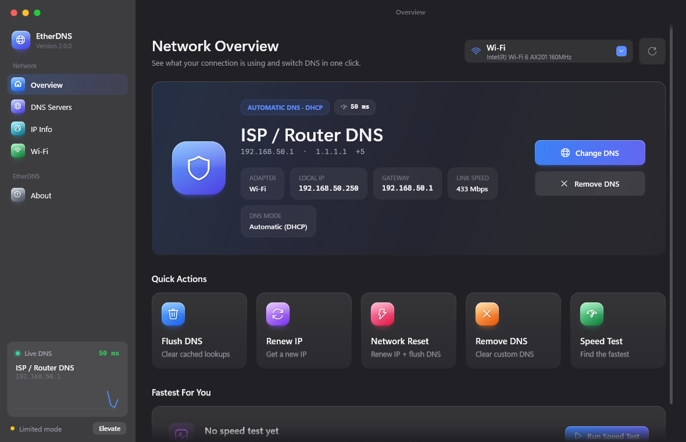
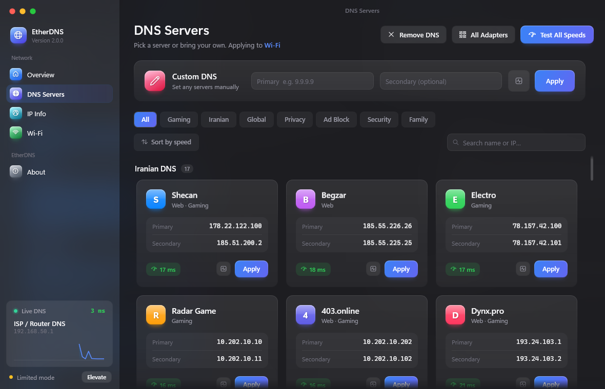
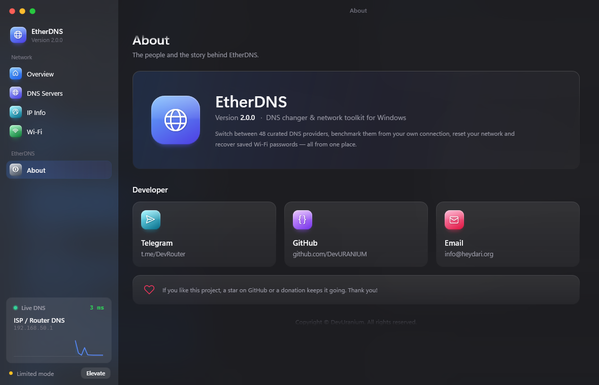

<div align="center">

# EtherDNS

**A modern DNS changer and network toolkit for Windows.**

Switch between 48 verified DNS servers in one click, benchmark them from your own connection,
see your public IP, reset your network and recover saved Wi-Fi passwords, all in one app.

[](#requirements)
[](https://dotnet.microsoft.com/)
[](#tech-stack)
[](LICENSE)
[](https://github.com/DevURANIUM/EtherDNS/releases/latest)

[**Download**](https://github.com/DevURANIUM/EtherDNS/releases/latest) ·
[Features](#features) ·
[DNS list](#dns-servers) ·
[Build from source](#build-from-source) ·
[Support](#support--donations)

<br/>



</div>

---

## Features

### Network Overview
- Live status of the active adapter: **DNS provider, local IP, gateway, link speed, DNS mode** (static or DHCP)
- Pick which adapter to manage (Wi-Fi, Ethernet, …)
- **Live DNS monitor**: response time of your current DNS, measured every few seconds and drawn as a chart
- Quick actions: **Flush DNS**, **Renew IP**, **Network Reset**, **Remove DNS**, **Speed Test**

### DNS Servers
- **48 verified DNS servers** organized into groups: Iranian, Global, Privacy, Ad Block, Security, Family
- **Gaming** filter, search by name or IP, and grouped or speed-ranked views
- **Speed test** for every server: sends real DNS queries over UDP (more accurate than ping, which many resolvers block)
- One-click **Apply**, plus **Custom DNS** for any primary/secondary pair you want
- **Remove DNS**: clear manual DNS (IPv4 + IPv6) from the selected adapter, or from **all adapters** at once
- The DNS you're currently using is highlighted; the fastest one is marked after a test

### IP Info
- Your **public IP** with country, region, city, ISP, organization, ASN, timezone and coordinates
- Show it on a map, or copy the IP / all details with one click
- Refreshes automatically when your connection changes (e.g. a VPN connects)
- Local network details: adapter, local IP, gateway, MAC address, DNS servers

### Wi-Fi
- Every Wi-Fi network this PC has saved, with its security type
- Show, hide or copy a saved password

### Design
- Dark **glass** interface using the native Windows 11 acrylic effect
- Rounded window with the system shadow, smooth animations and toast notifications

<div align="center">

</div>

---

## DNS servers

Every server below was checked to answer DNS queries before being added.

| Group | Servers |
|---|---|
| **Iranian** | Shecan, Begzar, Electro, Radar Game, 403.online, Dynx.pro, Private IP, Vanilla, TCI, AsiaTech, Shatel, Pishgaman, Mobinnet, ParsOnline, Sabanet, Taknet, Zi-Tel |
| **Global** | Google, Cloudflare, OpenDNS, Level3, Level3 Alt, Quad9 ECS, UltraDNS, Gcore, Yandex |
| **Privacy** | Quad9, Quad9 Unfiltered, DNS.SB, NextDNS, Control D, AdGuard Unfiltered |
| **Ad Block** | AdGuard, Control D Ad-Free, dnsforge |
| **Security** | Cloudflare Security, CleanBrowsing Security, Comodo Secure, Control D Malware, SafeDNS, Yandex Safe |
| **Family** | Cloudflare Family, AdGuard Family, OpenDNS FamilyShield, CleanBrowsing Family, CleanBrowsing Adult, Yandex Family, Control D Family |

Addresses live in [`Core/DnsCatalog.cs`](Core/DnsCatalog.cs). Adding a server takes one line.

> **Note:** some Iranian DNS servers (e.g. the `10.x.x.x` ones) only work on Iranian networks.
> Run **Test All Speeds** to see which ones answer on your connection.

---

## Requirements

- **Windows 10 or 11, 64-bit**
  - The glass effect needs Windows 11 22H2 or newer; older versions get a solid theme.
- **Administrator rights** to change DNS, flush the cache or renew the IP. The app asks for them when it starts.

The installer ships its own .NET runtime, so **you don't need to install .NET**.

---

## Installation

1. Download **`EtherDNS-Setup-2.0.0.exe`** from the [latest release](https://github.com/DevURANIUM/EtherDNS/releases/latest).
2. Run the installer and follow the steps. You can add a desktop shortcut.
3. Start **EtherDNS** from the Start menu and accept the administrator prompt.

To uninstall, use **Settings → Apps → Installed apps → EtherDNS**.

> **"Windows protected your PC"?** The installer isn't code-signed, so SmartScreen may warn you on first run.
> Click **More info → Run anyway** to continue.

---

## Build from source

### Prerequisites

- [.NET 9 SDK](https://dotnet.microsoft.com/download/dotnet/9.0)
- [Inno Setup 6](https://jrsoftware.org/isinfo.php), only needed to build the installer:

  ```bash
  winget install JRSoftware.InnoSetup
  ```

### Clone

```bash
git clone https://github.com/DevURANIUM/EtherDNS.git
cd EtherDNS
```

### Run in development

The app needs administrator rights, so run this from an **elevated** terminal (*Run as administrator*):

```bash
dotnet run
```

To work on the UI from a normal terminal, build it without the admin requirement (DNS changes won't work in this mode):

```bash
dotnet run -p:NoAdmin=true
```

### Build the installer

```bash
powershell -ExecutionPolicy Bypass -File build.ps1
```

This publishes a self-contained `win-x64` build to `publish/` and creates the installer at
`dist/EtherDNS-Setup-<version>.exe`. To publish without building an installer, add `-SkipInstaller`.

---

## How it works

| Feature | Under the hood |
|---|---|
| Set / remove DNS | `netsh interface ipv4/ipv6 set dnsservers …` on the selected adapter |
| Flush DNS / Renew IP | `ipconfig /flushdns`, `ipconfig /renew "<adapter>"` (only the selected adapter, with a timeout) |
| Active DNS & mode | `System.Net.NetworkInformation` + the adapter's `NameServer` registry value |
| Speed test | A raw DNS `A` query over UDP/53, best of several attempts |
| Public IP | [ipwho.is](https://ipwho.is), falling back to [ipinfo.io](https://ipinfo.io), then [ip-api.com](https://ip-api.com) |
| Wi-Fi passwords | `netsh wlan show profile name="…" key=clear` |

### Privacy
- **Wi-Fi passwords** are read from your own PC and never leave it.
- The **IP Info** page sends a request to the IP lookup services above, so they see your public IP. This only happens when you open that page or press Refresh.
- EtherDNS has no telemetry, accounts or analytics.

---

## Tech stack

- **C# / .NET 9**, **WPF**, no third-party packages
- Native Windows 11 window effects through DWM (dark title, rounded corners, acrylic backdrop)
- Installer built with **Inno Setup 6**

```
EtherDNS/
├── App.xaml / MainWindow.xaml   # shell: sidebar, navigation, toasts, dialogs
├── Core/                        # logic: DNS catalog, network, DNS probe, IP lookup, Wi-Fi, clipboard
├── Views/                       # pages: Overview, DNS Servers, IP Info, Wi-Fi, About
├── Themes/Theme.xaml            # colors, styles and control templates
├── installer/                   # Inno Setup script + installer artwork
├── legacy/                      # the original console version (v1.2), for reference
└── build.ps1                    # publish + installer
```

---

## Changelog

### v2.0.0
- Rewritten from a console app as a full **graphical app** with a Windows installer
- Grew the list from 19 to **48 verified DNS servers**, organized into groups
- New: real **DNS speed test**, **live DNS monitor**, **IP Info** page, **Remove DNS from all adapters**
- Fixed: **Network Reset** no longer hangs on PCs with VPN or virtual adapters (it renews only the selected adapter, with a timeout)
- Fixed: copying no longer fails when clipboard history is turned on

### v1.2
- Console version with the original 19 DNS servers. Its source is in [`legacy/`](legacy/).

---

## Contributing

Issues and pull requests are welcome.

- Found a bug or have an idea? [Open an issue](https://github.com/DevURANIUM/EtherDNS/issues).
- Know a reliable DNS server that's missing? Add it to [`Core/DnsCatalog.cs`](Core/DnsCatalog.cs) and open a PR.

---

## Support & Donations

If EtherDNS is useful to you, a ⭐ on GitHub helps a lot. You can also support development:

| Coin | Address |
|---|---|
| **BTC** | `bc1qcclcp574hnznm0nmdzzf0ta7366svjskttqks3` |
| **LTC** | `ltc1qcrkelw38gjrmg0ptjy2nshqej622kp76het7q0` |
| **XRP** | `rPoK5SBChFPqEiQv1W97LW6FKoJZLipDVQ` |
| **XLM** | `GDMUQREEZNBSTQOT5BV7MYEMXJFV3CYRZXUVOYCTIUZTHUWPHLVASFVD` |
| **TON** | `UQAJH2N0pqpvC9YN841w5NH1dCN9Lakwkpjvoy7vXf-vfqgv` |
| **TRON** | `TXJqhhwvkrTdnf5HReZf55hEzZuxjto3R4` |
| **USDT (BEP20)** | `0x1591036c4bD05b046532B65Df939fcd7824E18c7` |

---

## Developer



**DevUranium**

- Telegram: [t.me/DevRouter](https://t.me/DevRouter)
- GitHub: [github.com/DevURANIUM](https://github.com/DevURANIUM)
- Email: [info@heydari.org](mailto:info@heydari.org)

<br clear="right"/>

## License

Released under the [MIT License](LICENSE). Copyright © DevUranium.
